# Semantic Release - Complete Development Guide

A comprehensive guide for managing releases across different environments using semantic versioning.

## 🎯 Visual Guide for Developers

### Complete Development & Release Flow
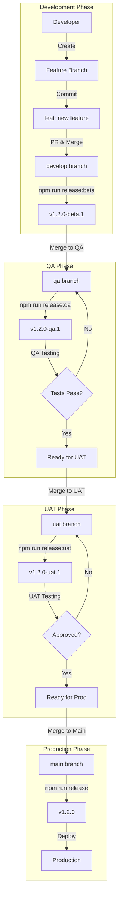

### Version Flow & Inheritance
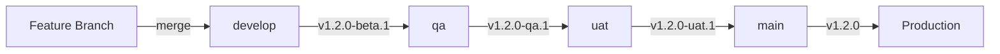

### Daily Development Workflow
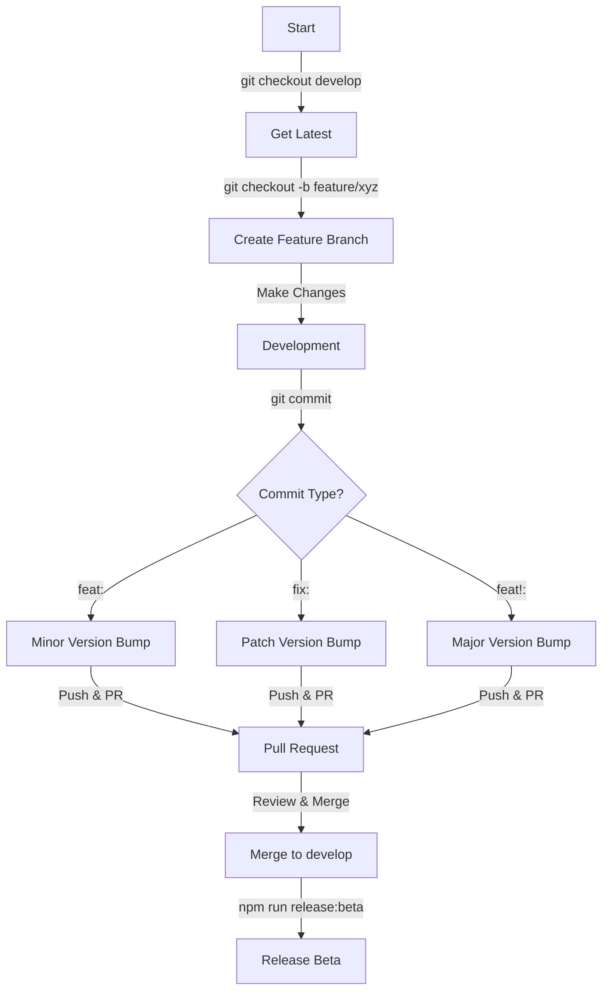

### Hotfix Process
```mermaid
graph TD
    A[Production Issue] -->|git checkout -b hotfix/xyz main| B[Create Hotfix]
    B -->|Fix Issue| C[Development]
    C -->|git commit -m "fix: issue"| D[Commit Fix]
    D -->|Merge to main| E[main branch]
    E -->|npm run release| F[v1.2.1]
    F -->|Backport| G[develop branch]
    G -->|npm run release:beta| H[v1.2.1-beta.1]
```

### Release Artifacts Generation
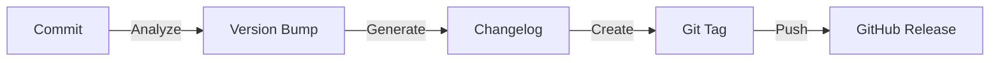

### Environment-Specific Colors & Indicators
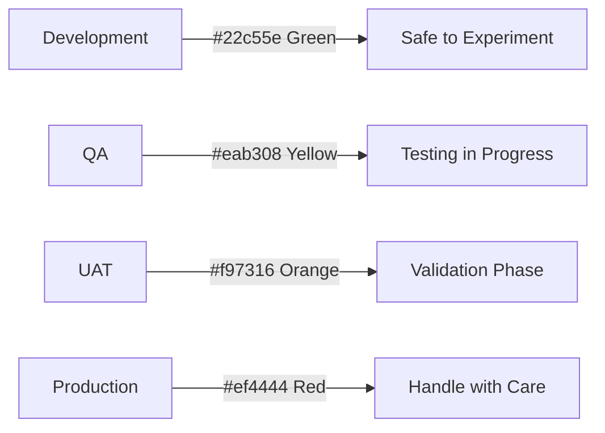

## 🚀 Quick Reference for Developers

### 1. Daily Development Commands
```bash
# Start new feature
git checkout develop
git pull
git checkout -b feature/xyz
# ... make changes ...
git commit -m "feat: add new feature"
git push origin feature/xyz

# Create PR and merge to develop
npm run release:beta
```

### 2. Version Cheat Sheet
| What Changed? | Commit Message | New Version |
|--------------|----------------|-------------|
| New Feature | `feat: add login` | 1.1.0-beta.1 |
| Bug Fix | `fix: null check` | 1.0.1-beta.1 |
| Breaking Change | `feat!: new API` | 2.0.0-beta.1 |

### 3. Branch Quick Guide
| I want to... | Use Branch | Command |
|--------------|------------|---------|
| Develop new feature | `feature/*` | `git checkout -b feature/xyz develop` |
| Fix a bug | `bugfix/*` | `git checkout -b bugfix/xyz develop` |
| Emergency prod fix | `hotfix/*` | `git checkout -b hotfix/xyz main` |

### 4. Release Commands
```bash
npm run release:beta  # Develop → QA
npm run release:qa    # QA → UAT
npm run release:uat   # UAT → Prod
npm run release      # Production Release
```

### 5. Common Scenarios

#### A. Need to fix a bug in production?
```bash
git checkout main
git checkout -b hotfix/critical-bug
# fix the bug
git commit -m "fix: critical bug"
npm run release
```

#### B. Feature ready for QA?
```bash
git checkout qa
git merge develop
npm run release:qa
```

#### C. Resolve merge conflicts?
```bash
# Option 1: Keep their changes
git merge develop -X theirs

# Option 2: Keep our changes
git merge develop -X ours
```

## 📑 Table of Contents
1. [Quick Start](#-quick-start)
2. [Branch Strategy](#-branch-strategy)
3. [Version Management](#-version-management)
4. [Development Workflow](#-development-workflow)
5. [Release Process](#-release-process)
6. [Commit Guidelines](#-commit-guidelines)
7. [Troubleshooting](#-troubleshooting)
8. [Behind The Scenes: Automation & Processes](#-behind-the-scenes-automation-processes)

## 🚀 Quick Start

### Installation
```bash
# Install dependencies
npm install

# Setup environment
npm run setup
```

### Available Commands
```bash
npm run release        # Production release
npm run release:beta   # Development release
npm run release:qa     # QA release
npm run release:uat    # UAT release
npm run release:hotfix # Hotfix release
```

## 🌳 Branch Strategy

### Branch Hierarchy
```
main (Production)
  ↑
uat (Pre-production)
  ↑
qa (Quality Assurance)
  ↑
develop (Development)
  ↑
feature/* (Feature Branches)
```

### Branch Purposes
| Branch | Purpose | Version Format | Example |
|--------|---------|----------------|---------|
| `main` | Production releases | x.y.z | 1.2.2 |
| `uat` | Pre-production testing | x.y.z-uat.n | 1.2.2-uat.1 |
| `qa` | Quality assurance | x.y.z-qa.n | 1.2.1-qa.1 |
| `develop` | Development integration | x.y.z-beta.n | 1.2.0-beta.1 |
| `feature/*` | New features | Based on develop | feature/auth |
| `hotfix` | Emergency fixes | x.y.z-hotfix.n | 1.2.2-hotfix.1 |

## 📦 Version Management

### Version Format Rules
- Production (main): `1.2.3`
- Development (develop): `1.2.3-beta.1`
- QA: `1.2.3-qa.1`
- UAT: `1.2.3-uat.1`
- Hotfix: `1.2.3-hotfix.1`

### Version Bump Rules
| Change Type | Description | Version Increment | Example |
|-------------|-------------|------------------|---------|
| Major | Breaking changes | x+1.0.0 | 1.0.0 → 2.0.0 |
| Minor | New features | x.y+1.0 | 1.0.0 → 1.1.0 |
| Patch | Bug fixes | x.y.z+1 | 1.0.0 → 1.0.1 |

## 👨‍💻 Development Workflow

### 1. Starting New Feature
```bash
# Create feature branch
git checkout develop
git pull origin develop
git checkout -b feature/new-feature

# Make changes and commit
git add .
git commit -m "feat: add new authentication system"

# Push changes
git push origin feature/new-feature
```

### 2. Completing Feature
```bash
# Update develop
git checkout develop
git pull origin develop

# Merge feature
git merge feature/new-feature
npm run release:beta

# Push changes
git push origin develop
```

### 3. QA Release
```bash
# Update QA
git checkout qa
git pull origin qa
git merge develop
npm run release:qa

# Push changes
git push origin qa
```

### 4. UAT Release
```bash
# Update UAT
git checkout uat
git pull origin uat
git merge qa
npm run release:uat

# Push changes
git push origin uat
```

### 5. Production Release
```bash
# Update main
git checkout main
git pull origin main
git merge uat
npm run release

# Push changes
git push origin main
```

## 📝 Commit Guidelines

### Commit Message Format
```
type(scope): subject

[optional body]
[optional footer]
```

### Commit Types
| Type | Description | Triggers Version Bump |
|------|-------------|---------------------|
| `feat` | New feature | Minor |
| `fix` | Bug fix | Patch |
| `docs` | Documentation | Patch |
| `style` | Formatting | Patch |
| `refactor` | Code restructuring | Patch |
| `test` | Adding tests | Patch |
| `chore` | Maintenance | Patch |
| `BREAKING` | Breaking changes | Major |

### Examples
```bash
# Feature
git commit -m "feat(auth): add OAuth2 authentication"

# Bug fix
git commit -m "fix(api): handle null responses"

# Breaking change
git commit -m "feat(api)!: completely redesign authentication API
BREAKING CHANGE: New API is not backward compatible"
```

## 🔄 Release Process

### Standard Release Flow
1. **Development (develop)**
   ```bash
   npm run release:beta   # 1.1.0-beta.1
   ```

2. **QA Testing (qa)**
   ```bash
   npm run release:qa     # 1.1.0-qa.1
   ```

3. **UAT Validation (uat)**
   ```bash
   npm run release:uat    # 1.1.0-uat.1
   ```

4. **Production (main)**
   ```bash
   npm run release        # 1.1.0
   ```

### Hotfix Process
```bash
# Create hotfix
git checkout -b hotfix/critical-fix main

# Fix and commit
git commit -m "fix: resolve critical issue"

# Release hotfix
git checkout main
git merge hotfix/critical-fix
npm run release

# Backport to develop
git checkout develop
git merge main
npm run release:beta
```

## ⚠️ Troubleshooting

### Common Issues and Solutions

1. **Merge Conflicts**
   ```bash
   # Option 1: Keep their changes
   git merge develop -X theirs
   
   # Option 2: Keep our changes
   git merge develop -X ours
   ```

2. **Version Mismatch**
   ```bash
   # Check versions
   git checkout develop && npm version
   git checkout qa && npm version
   git checkout uat && npm version
   git checkout main && npm version
   ```

3. **Release Failure**
   ```bash
   # Clean and retry
   git stash
   npm run release:qa
   git stash pop
   ```

### Pre-release Checklist
- [ ] All tests passing
- [ ] Code reviewed
- [ ] Documentation updated
- [ ] Changelog reviewed
- [ ] Version numbers correct
- [ ] Branch is clean
- [ ] Dependencies updated

### Post-release Checklist
- [ ] Tags pushed
- [ ] Release notes published
- [ ] Deployment verified
- [ ] Downstream branches updated
- [ ] Stakeholders notified

## 🔧 Behind The Scenes: Automation & Processes

### 1. Semantic Release Process Flow
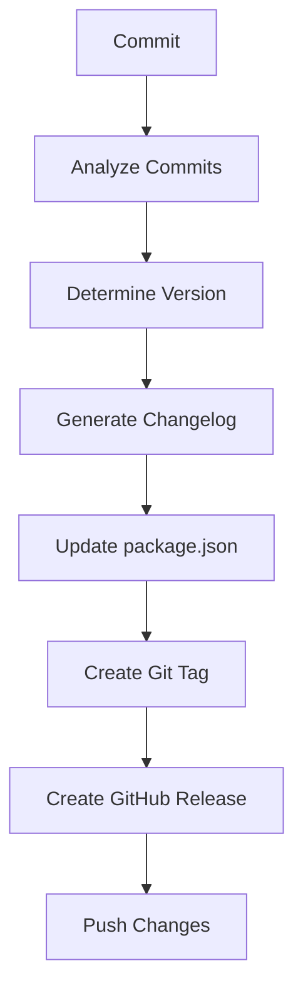

### 2. Version Management Automation

#### A. Version Calculation
```javascript
// Example of how versions are calculated
currentVersion = "1.2.3"
branch = "develop"

// For feature on develop
if (commitType === "feat") {
  newVersion = "1.3.0-beta.1"  // Minor bump
} else if (commitType === "fix") {
  newVersion = "1.2.4-beta.1"  // Patch bump
}
```

#### B. Tag Creation Process
```bash
# 1. Version tag is created
git tag -a v1.2.3 -m "Release v1.2.3"

# 2. Branch-specific tag
git tag -a v1.2.3-beta.1 -m "Beta release v1.2.3-beta.1"

# 3. Tags are pushed
git push origin --tags
```

### 3. Changelog Generation

#### A. Commit Analysis
```javascript
// Commit message structure
type(scope): subject

// Examples analyzed:
"feat(auth): add OAuth2"     // Minor bump
"fix(api): handle nulls"     // Patch bump
"feat!: new API"             // Major bump
```

#### B. Changelog Structure
```markdown
# [1.2.0](compare/v1.1.0...v1.2.0) (2024-02-01)

### Features
* add OAuth2 authentication (a5b2c3d)

### Bug Fixes
* handle null API responses (e4f3g2h)
```

### 4. Branch-Specific Processes

#### A. Develop Branch
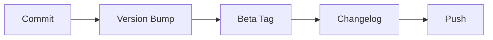

1. **Version Calculation**
   ```javascript
   // On develop branch
   newVersion = `${nextVersion}-beta.${betaNumber}`
   // Example: 1.2.0-beta.1
   ```

2. **Automated Steps**
   ```bash
   # 1. Update version
   npm version 1.2.0-beta.1 --no-git-tag-version
   
   # 2. Update changelog
   conventional-changelog -p angular -i CHANGELOG.md -s
   
   # 3. Create beta tag
   git tag -a v1.2.0-beta.1
   
   # 4. Push changes
   git push && git push --tags
   ```

#### B. QA Branch
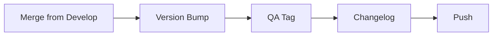

1. **Version Calculation**
   ```javascript
   // On qa branch
   newVersion = `${nextVersion}-qa.${qaNumber}`
   // Example: 1.2.0-qa.1
   ```

2. **Automated Steps**
   ```bash
   # 1. Update version
   npm version 1.2.0-qa.1 --no-git-tag-version
   
   # 2. Update changelog
   conventional-changelog -p angular -i CHANGELOG.md -s
   
   # 3. Create qa tag
   git tag -a v1.2.0-qa.1
   
   # 4. Push changes
   git push && git push --tags
   ```

#### C. UAT Branch
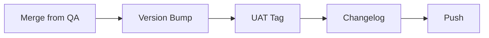

1. **Version Calculation**
   ```javascript
   // On uat branch
   newVersion = `${nextVersion}-uat.${uatNumber}`
   // Example: 1.2.0-uat.1
   ```

2. **Automated Steps**
   ```bash
   # 1. Update version
   npm version 1.2.0-uat.1 --no-git-tag-version
   
   # 2. Update changelog
   conventional-changelog -p angular -i CHANGELOG.md -s
   
   # 3. Create uat tag
   git tag -a v1.2.0-uat.1
   
   # 4. Push changes
   git push && git push --tags
   ```

#### D. Main Branch
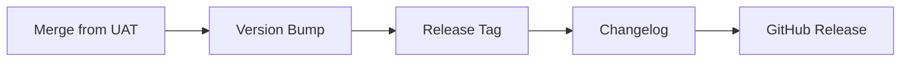

1. **Version Calculation**
   ```javascript
   // On main branch
   newVersion = nextVersion
   // Example: 1.2.0
   ```

2. **Automated Steps**
   ```bash
   # 1. Update version
   npm version 1.2.0 --no-git-tag-version
   
   # 2. Update changelog
   conventional-changelog -p angular -i CHANGELOG.md -s
   
   # 3. Create release tag
   git tag -a v1.2.0
   
   # 4. Push changes
   git push && git push --tags
   
   # 5. Create GitHub release
   gh release create v1.2.0 --notes-file CHANGELOG.md
   ```

### 5. Release Notes Generation

#### A. Components of Release Notes
1. **Version Header**
   ```markdown
   # [1.2.0](compare/v1.1.0...v1.2.0) (2024-02-01)
   ```

2. **Feature Section**
   ```markdown
   ### Features
   * **auth:** add OAuth2 authentication (#123)
   * **api:** add new endpoints (#124)
   ```

3. **Fixes Section**
   ```markdown
   ### Bug Fixes
   * **api:** handle null responses (#125)
   * **ui:** fix button alignment (#126)
   ```

4. **Breaking Changes**
   ```markdown
   ### BREAKING CHANGES
   * **api:** complete redesign of authentication system
   ```

#### B. Automated Release Notes Process
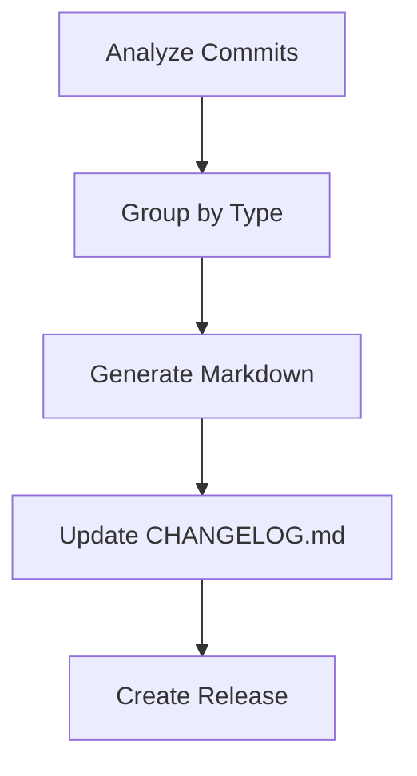

### 6. Configuration Files

#### A. release.config.js
```javascript
module.exports = {
  branches: [
    'main',
    { name: 'develop', prerelease: 'beta' },
    { name: 'qa', prerelease: 'qa' },
    { name: 'uat', prerelease: 'uat' }
  ],
  plugins: [
    '@semantic-release/commit-analyzer',
    '@semantic-release/release-notes-generator',
    '@semantic-release/changelog',
    '@semantic-release/npm',
    '@semantic-release/git',
    '@semantic-release/github'
  ]
}
```

#### B. .releaserc
```json
{
  "plugins": [
    ["@semantic-release/commit-analyzer", {
      "preset": "angular",
      "releaseRules": [
        {"type": "feat", "release": "minor"},
        {"type": "fix", "release": "patch"},
        {"type": "docs", "release": "patch"},
        {"breaking": true, "release": "major"}
      ]
    }],
    "@semantic-release/release-notes-generator",
    "@semantic-release/changelog",
    "@semantic-release/npm",
    "@semantic-release/git",
    "@semantic-release/github"
  ]
}
```

## 🔄 End-to-End Process: Development to Client Deployment

### 1. Complete Development Lifecycle
```mermaid
graph TD
    subgraph "1. Development Environment"
        A[Developer] -->|Code| B[Feature Branch]
        B -->|Build & Test| C[Local Testing]
        C -->|PR| D[Code Review]
        D -->|Merge| E[develop branch]
        E -->|npm run release:beta| F[Beta Release]
    end

    subgraph "2. Build & Test"
        F -->|Automated Tests| G[Unit Tests]
        G -->|Integration| H[E2E Tests]
        H -->|Build| I[Development Build]
        I -->|Deploy| J[Dev Environment]
    end

    subgraph "3. QA Process"
        J -->|QA Merge| K[qa branch]
        K -->|npm run release:qa| L[QA Build]
        L -->|Deploy| M[QA Environment]
        M -->|Testing| N{QA Approval}
    end

    subgraph "4. UAT Validation"
        N -->|Pass| O[uat branch]
        O -->|npm run release:uat| P[UAT Build]
        P -->|Deploy| Q[UAT Environment]
        Q -->|Client Testing| R{UAT Approval}
    end

    subgraph "5. Production Release"
        R -->|Pass| S[main branch]
        S -->|npm run release| T[Production Build]
        T -->|Deploy| U[Production]
        U -->|Monitor| V[Production Monitoring]
    end
```

### 2. Build Process for Each Environment

#### A. Development Build
```bash
# 1. Install dependencies
npm install

# 2. Run tests
npm run test

# 3. Build for development
npm run build:dev

# 4. Create development artifacts
├── dist/
│   ├── assets/
│   ├── index.html
│   └── main.js
```

#### B. QA Build
```bash
# 1. QA environment setup
npm run build:qa

# 2. QA specific configurations
├── dist-qa/
│   ├── assets/
│   ├── index.html
│   └── main.js
```

#### C. UAT Build
```bash
# 1. UAT environment setup
npm run build:uat

# 2. UAT specific configurations
├── dist-uat/
│   ├── assets/
│   ├── index.html
│   └── main.js
```

#### D. Production Build
```bash
# 1. Production optimization
npm run build:prod

# 2. Production artifacts
├── dist-prod/
│   ├── assets/
│   ├── index.html
│   └── main.js
```

### 3. Deployment Process

#### A. Environment Configuration
```javascript
// .env.development
VITE_API_URL=https://dev-api.example.com
VITE_APP_ENV=development

// .env.qa
VITE_API_URL=https://qa-api.example.com
VITE_APP_ENV=qa

// .env.uat
VITE_API_URL=https://uat-api.example.com
VITE_APP_ENV=uat

// .env.production
VITE_API_URL=https://api.example.com
VITE_APP_ENV=production
```

#### B. Deployment Checklist
```markdown
### Pre-deployment
- [ ] All tests passing
- [ ] Build successful
- [ ] Environment variables set
- [ ] Database migrations ready
- [ ] API endpoints configured

### During deployment
- [ ] Database backup
- [ ] Zero-downtime deployment
- [ ] SSL certificates valid
- [ ] CDN cache cleared
- [ ] DNS settings verified

### Post-deployment
- [ ] Health checks passing
- [ ] Monitoring active
- [ ] Logs streaming
- [ ] Performance metrics normal
- [ ] User access verified
```

### 4. Client Delivery Process

#### A. Documentation Package
```markdown
### Release Package Contents
1. Release Notes
   - New features
   - Bug fixes
   - Breaking changes
   - Known issues

2. Installation Guide
   - System requirements
   - Setup instructions
   - Configuration steps

3. User Guide
   - Feature documentation
   - Usage examples
   - Best practices

4. API Documentation
   - Endpoint changes
   - Request/Response examples
   - Authentication updates
```

#### B. Client Communication
```markdown
### Release Communication Timeline
1. Pre-release Notice (1 week before)
   - Release date
   - Feature summary
   - Required actions

2. Release Day
   - Deployment schedule
   - Downtime notice
   - Emergency contacts
```

### 5. Monitoring & Support

#### A. Health Monitoring
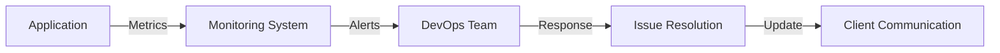

#### B. Support Levels
```markdown
### Support Tiers
1. L1 - Basic Support
   - User access issues
   - Basic functionality
   - General queries

2. L2 - Technical Support
   - Complex issues
   - Performance problems
   - Integration issues

3. L3 - Expert Support
   - Critical bugs
   - Security issues
   - Architecture problems
```

### 6. Rollback Procedures

#### A. Quick Rollback Process
```bash
# 1. Revert to previous version
git checkout main
git revert HEAD
npm run release

# 2. Deploy previous version
npm run build:prod
npm run deploy:prod

# 3. Verify rollback
npm run health-check
```

#### B. Data Recovery
```markdown
### Recovery Steps
1. Database Rollback
   - Restore backup
   - Verify data integrity
   - Check relationships

2. File System Recovery
   - Restore assets
   - Check permissions
   - Verify access

3. Configuration Reset
   - Environment variables
   - API endpoints
   - Cache clearing
```

## 🔄 Semantic Release Internal Workflow

### 1. How Semantic Release Works
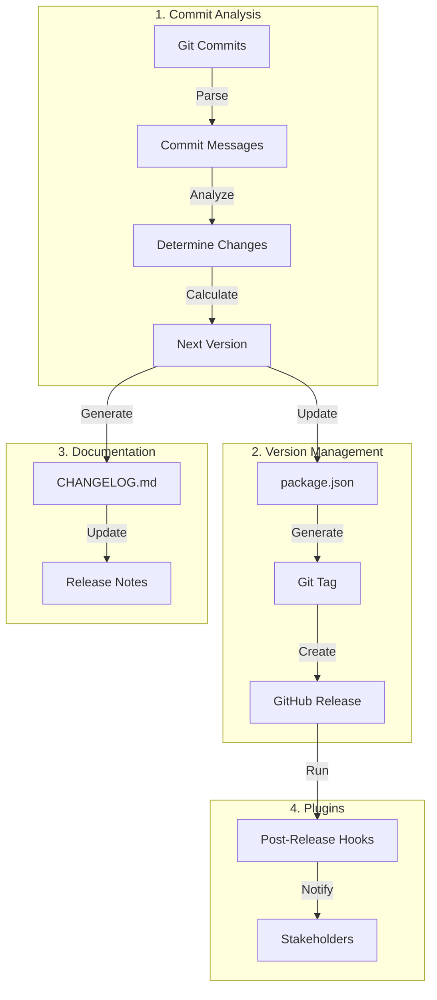

### 2. Semantic Release Step-by-Step Process

#### A. Verification Phase
```javascript
// 1. Check Environment
verifyConditions: [
  "@semantic-release/github",
  "@semantic-release/npm",
  "@semantic-release/git"
]

// 2. Verify Authentication
checkCredentials: {
  github: process.env.GITHUB_TOKEN,
  npm: process.env.NPM_TOKEN
}
```

#### B. Analysis Phase
```javascript
// 1. Commit Analysis
analyzeCommits: {
  // Parse all commits since last release
  commits.forEach(commit => {
    if (commit.type === 'feat') return 'minor';
    if (commit.type === 'fix') return 'patch';
    if (commit.breaking) return 'major';
  });
}

// 2. Version Calculation
calculateNextVersion: {
  const current = '1.2.3';
  const bump = 'minor';
  return getNextVersion(current, bump); // 1.3.0
}
```

#### C. Generation Phase
```javascript
// 1. Generate Release Notes
generateNotes: {
  const notes = commits.map(commit => {
    return formatCommit(commit);
  });
  return generateMarkdown(notes);
}

// 2. Update Changelog
prepare: [
  {
    path: '@semantic-release/changelog',
    changelogFile: 'CHANGELOG.md',
  }
]
```

#### D. Publishing Phase
```javascript
// 1. Version Update
prepare: [
  {
    path: '@semantic-release/npm',
    npmPublish: false,
  }
]

// 2. Git Updates
prepare: [
  {
    path: '@semantic-release/git',
    assets: ['package.json', 'CHANGELOG.md'],
    message: 'chore(release): ${nextRelease.version}'
  }
]
```

### 3. Branch-Specific Release Process

#### A. Development Release (develop)
```javascript
// release.config.js
{
  branches: [{
    name: 'develop',
    prerelease: 'beta',
    channel: 'beta'
  }],
  // Process:
  // 1. feat: add login → 1.1.0-beta.1
  // 2. fix: update login → 1.1.0-beta.2
  // 3. feat: add logout → 1.2.0-beta.1
}
```

#### B. QA Release (qa)
```javascript
{
  branches: [{
    name: 'qa',
    prerelease: 'qa',
    channel: 'qa'
  }],
  // Process:
  // 1. merge develop → 1.1.0-qa.1
  // 2. fix qa issues → 1.1.1-qa.1
  // 3. merge new features → 1.2.0-qa.1
}
```

#### C. UAT Release (uat)
```javascript
{
  branches: [{
    name: 'uat',
    prerelease: 'uat',
    channel: 'uat'
  }],
  // Process:
  // 1. merge qa → 1.1.0-uat.1
  // 2. fix uat issues → 1.1.1-uat.1
  // 3. client approval → ready for prod
}
```

#### D. Production Release (main)
```javascript
{
  branches: ['main'],
  // Process:
  // 1. merge uat → 1.1.0
  // 2. create git tag
  // 3. generate release notes
  // 4. create GitHub release
}
```

### 4. Plugin Execution Order

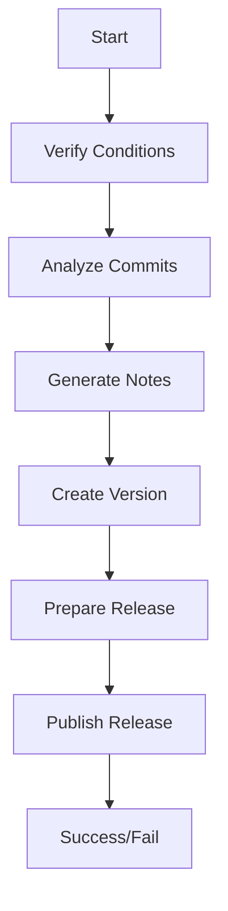

### 5. Release Artifacts

#### A. Version Updates
```json
{
  "name": "your-project",
  "version": "1.2.3",
  // Updated automatically by @semantic-release/npm
}
```

#### B. Changelog Updates
```markdown
# [1.2.3](compare/v1.2.2...v1.2.3)

### Features
* New authentication system
* Improved performance

### Bug Fixes
* Fixed login issues
* Corrected API responses
```

#### C. Git Tags
```bash
# Format: v{major}.{minor}.{patch}[-{prerelease}]
v1.2.3
v1.2.3-beta.1
v1.2.3-qa.1
v1.2.3-uat.1
```

#### D. GitHub Release
```json
{
  "tag_name": "v1.2.3",
  "name": "Release v1.2.3",
  "body": "Release notes from CHANGELOG.md",
  "draft": false,
  "prerelease": false
}
```

### 6. Environment Variables Required

```bash
# GitHub Authentication
GITHUB_TOKEN=your_github_token

# NPM Configuration (if publishing)
NPM_TOKEN=your_npm_token

# Branch Configuration
BRANCH_NAME=develop|qa|uat|main

# Release Configuration
RELEASE_BRANCH=true|false
DEBUG=semantic-release:*
```

### 7. Common Release Scenarios

#### A. Feature Release
```bash
# 1. Develop Branch
git checkout develop
git commit -m "feat: new feature"
npx semantic-release
# Result: 1.1.0-beta.1

# 2. QA Branch
git checkout qa
git merge develop
npx semantic-release
# Result: 1.1.0-qa.1

# 3. UAT Branch
git checkout uat
git merge qa
npx semantic-release
# Result: 1.1.0-uat.1

# 4. Main Branch
git checkout main
git merge uat
npx semantic-release
# Result: 1.1.0
```

#### B. Hotfix Release
```bash
# 1. Create Hotfix
git checkout -b hotfix/bug main
git commit -m "fix: critical issue"

# 2. Release to Main
git checkout main
git merge hotfix/bug
npx semantic-release
# Result: 1.1.1

# 3. Backport to Other Branches
git checkout develop
git merge main
npx semantic-release
# Result: 1.1.1-beta.1
```